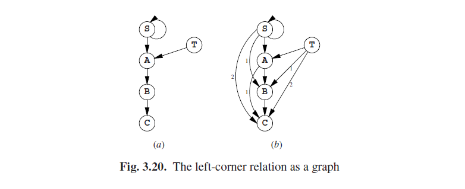

# 3.9 传递闭包

解析中的许多算法（以及在计算机科学中的许多其他分支）都具有一些从初始信息开始的属性，然后根据一些理论规则推到得出结论，一直到不能得出更多的结论为止。在2.9.5.1 和2.9.5.2 节中的推理规则中, 我们已经看到了两个例子。这些推理是完全不同的，并且一般的推理规则可以是任意复杂的。为了得到一个清晰的计算结论的算法，闭包算法，我们现在将考虑一个最简单的可能的推理规则: 传递性。这种规则的形式如下：

如果*A$$\bigotimes$$B* 并且*B$$\bigotimes$$C* 那么*A$$\bigotimes$$C*

其中$$\bigotimes$$是任意符合规则的操作符。最明显的是=，但是<和$$\leq$$以及其他许多也是可以的。但是$$\neq$$（不等于）却不是的。

作为一个例子，我们将考虑一个非终结符的“左角集”的计算。一个非终结符*B*在一个非终结符*A*的左角集中，如果有一个派生*A$$\overset{ * }{\rightarrow}$$B···*，知道这点有时是有用的，因为在其他方面来说，任何*B*可以开始的字符*A*也都能开始。

有下面这样一个语法

我们如何才能找出**C**在**S**的左角集中？语法中的规则**S$$\rightarrow$$ST**和**S$$\rightarrow$$Aa**立即就让我们知道**S**和**A**在**S**的左角集中。我们把这写作**S∠S**和**A∠S**，其中∠代表左角。这同样告诉我们**A∠T**,**B∠A**，还有**C∠B**。这是我们的初始信息（图3.19（a））。

现在很容易看出，如果**A**在**B**的左角集中，**B**在**C**的左角集中，那么**A**也在**C**的左角集中。公式如下：

A∠B ∧ B∠C $$\Rightarrow$$ A∠C

这是我们的*推理规则*，而且我们将使用它来得出新结论或“推论”，通过两两组合已知的事实来产生更多的已知因子。然后通过应用推理规则直到不再产生新的因子来获得传递闭包。在传递闭包的上下文中，因子也被称为“关系”，虽然一般∠是（二进制）关系，并且A∠B和B∠C 是关系的 "实例"。

通过图 3.19 (a) 中的列表，我们首先将**S∠S**和**S∠S**结合起来。这将产生**S∠S**,这是相当令人失望的因为我们已经知道了；它在图 3.19 (b) 中, 标有一个**√**, 以表明它不是新的。（**S∠S, A∠S**的）结合产生**A∠S**，但是我们也已经知道了。没有其他的因子与**S∠S**结合，所以我们继续看**A∠S**，而这得到了**A∠S**和**B∠S**；第一个我们已经知道了，但是第二个是第一次被我们知道。接着（**A∠T**,**B∠A**）就得到了**B∠T**，等等，做完剩下部分的第一轮结果见图3.19(b)。

第二轮结合了三个有新有旧的因子。第一个是发现由**A∠S**和**C∠A (c)**得到了**C∠S**，第二个发现是**C∠T**。

第三轮将（c）中的两个新因子与（a），（b），（c）中的结合起来，但没有发现新的因子；所以这个算法最终发现了10个因子。

请注意，我们已经在这个初级算法中实现了一次优化：基础算法将启动第二轮甚至更多轮次，通过将已知的所有因子之间配对，而不仅仅只是在新发现的因子之间。

在一个图中用弧线表示因子或关系通常是有帮助的。最初的情况见图3.20 (a)，最终的结果见（b）。箭头旁边的数字表明得到该因子经过了几轮计算。

闭包算法的效率很大程度上依赖于它所所使用的推理算法，而传递规则的情况被广泛的进行了研究。传递闭包主要有三种方法来进行：初级版、普通版和高级版；我们将简要的对每一种进行介绍。上面描述过的初级算法，在通常情况下往往是相当有效率的，但会画出一张很大的图，而且特殊情况下可能会需要计算很多轮。同样它还会重复计算很多次，我们可以在图3.19中看出；15个结果中有10个是已经得到了的。但考虑到“正常”语法的大小，初级算法几乎可以满足所有情况下的解析。

普通的进行传递闭包的方式是使用Warshall的算法[409]。其优势是非常简单实现，而且它需要的时间仅取决于图中*N*节点的数量而不是弧线的数量，但它的缺点是总是需要*O（N3）*的时间。这回让它在和其他任何闭包算法的比较中总是输掉。

高级算法避免了导致初级算法效率底下的劣势：1.图中的圆圈被收敛为“强联通分量”；2.弧线以一种顺序组合起来，并允许弧线进行复制而不是重复计算；3.使用更有效的数据表示。例如，一个高级算法首先会计算从**A**的所有输出弧，然后将之拷贝至**T**而不是重新计算一次。Tarjan [334] 描述了第一个高级可传递闭包算法。并在其他很多刊物上广泛转载；见Nuutila[412]和互联网。它需要的时间与其最终得出的结果数量成正比。

高级可传递闭包算法在大型应用程序 (数据库等) 中非常有用，但它在解析中的位置确实令人怀疑的。一些作者建议在LALR解析器生成器中使用它们，但应该在非常庞大的语法上使用，以保证算法的复杂性有一个很好的回报。

强调算法的闭包性质的优点可以让人集中于推理规则，并将底层的闭包算法当做理所当然；这对于算法设计很有帮助。然而大多数的解析算法都很简单，以至于不需要分解成推理规则和闭包解释。因此我们将仅在有助于理解的地方使用推理规则（9.7.1.3节），以及当其原本就是语法的一部分的情况下使用（7.3节，图表解析）。对于其余的我们将简单的讲述算法，然后指出他们是传递闭包算法得出的。