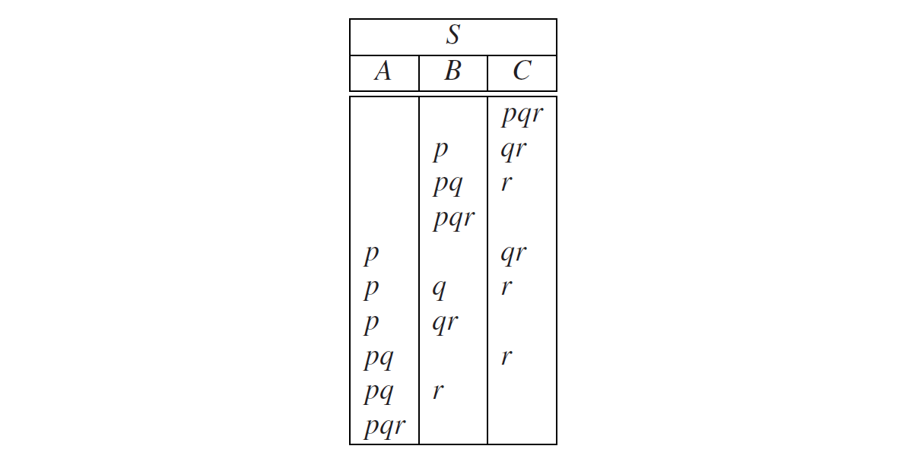
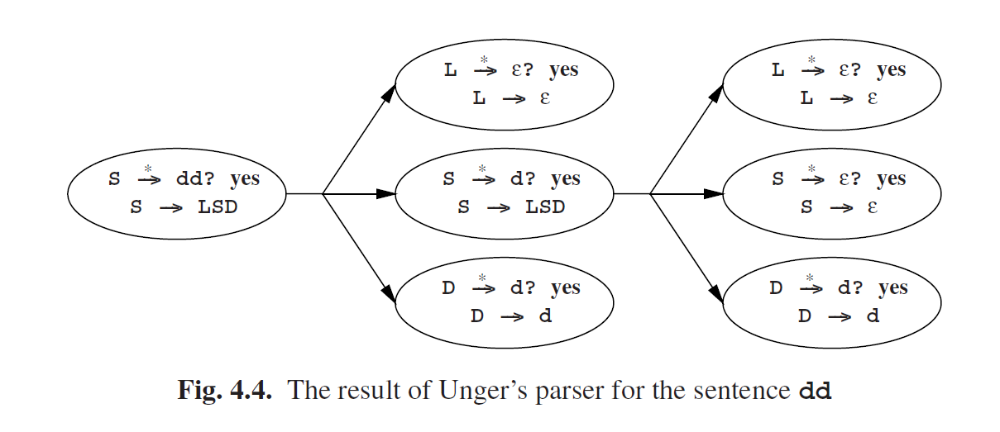

# 4.1.2 含有ε规则的Unger方法

到目前为止，我们只说了不包含ε规则的语法，而这不是没有原因的。当语法包含了ε规则时就会变得复杂，下面的例子就说明了这点：假设语法规则*S → ABC*，以及输入语句*pqr*。如果我们要验证这个规则是否能导出输入语句，并且我们用ε规则，那我们必须要考虑很多部分，因为每一个非终结符*A*，*B*，*C*都可能派生出空字符串。在这种情况下，生成所有分区的过程和上面一样，只是我们首先生成的杯子中没有大理石分区，而杯子1有大理石1分区，等等：

现在假设我们在试验*B*是否能生成*qpr*，并假设有一个规则*B→SD*。那么，我们将不得不尝试一下以下分区：

这是这些分区中最后一个会造成麻烦的分区：在寻找*S*是否导出*qpr*的过程中，我们最终会在不同的上下文中问出同样的问题。如果我们不小心没有检查到这一点，那我们的解析器就会陷入死循环中或者内存溢出。

当沿着这条路劲搜索时，我们其实是在寻找以*S→· · ·→αSβ*这种形式得出的推导。如果语法包含ε规则，那么解析器必须假定α和β可以产生ε，这个循环将会导致解析器一遍又一遍的抛出“*S*是否派生*qpr*？”这个问题。

如果α和β确实生成了ε，那么在这条路劲上能找到无数可以推导出的因子，前提是至少能生成ε，所以我们永远都无法列举完他们。唯一有意思的是推导那些没有循环的。因此，这样的情况下我们会停下工作。另一方面，如果α和β不能都生成ε，这样的截止也不会造成什么影响，因为如果最初的尝试没有成功，那么二次搜索无论如何都注定会失败。

因此我们完全可以通过结束搜索过程来避免这种情况。幸运的是，这不是一个很难的任务。我们所需要做的就是维护一个我们目前正在进行的问题的列表。在开始一个新问题之前（例如“*S*是否派生*qpr*？”），我们先确认一下这个问题并没有出现在列表中。如果出现了，那我们就放弃这个问题。反之我们就可以继续这个问题了。

例如, 请考虑以下语法：

这个语法以一种尴尬的方式生成**d**的序列。对于问题**S$$\overset{ * }{\rightarrow }$$d**？和**S$$\overset{ * }{\rightarrow }$$dd**？的完全搜索如图Fig 4.3。图Fig 4.3必须从左到右，从上到下看。问题是椭圆形中的，在右侧框中分隔开。如果至少有一个框的结果是“yes”，那么问题就是一个肯定的回答。相反，只有当全部的问题都是“yes”，那这部分最后的结果才是肯定的。

寻找停止的问题很简单：如果提出新的问题，我们就沿着箭头相反的方向走（向左）。这样我们就遍历了当前的问题列表。如果再次遇到这个问题，那我们就可以停止了。

要找到解析，每一个得到肯定结果的问题都必须传回一列规则，这些规则开启了问题中所要求的派出。这些规则列表可以放入椭圆中，与问题一起。我们在图Fig 4.3中没有这么做，因为它已经够复杂了。然而当我们去掉图Fig 4.3中的死角并拿掉方框，我们就得到了图Fig 4.4。这种情况下，每个椭圆只有一个可能的语法规则。

因此，只有一个解析，我们通过图Fig 4.4来得到它。从上到下从左到右的查看：

一般情况下, 解析的总数等于每个椭圆中语法规则数的乘积。

这个例子表明，我们可以通过记住问题的答案来节省大量时间。例如，问题**L**是否派生**ε**被提出了很多次。Sheil [20]已经表明，这样可以显著的提升效率：从指数变化变成线性变化。另一个优势是，可以通过预先的计算得到哪个非终结符可以派生出**ε**。实际上，计算每一个非终结符派生的终结符字符串的最小长度是一种特殊情况。如果一个非终结符能派生出**ε**，最短长度是0。