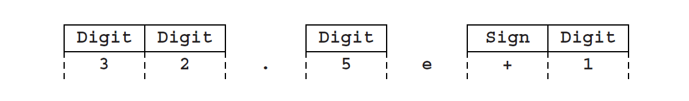
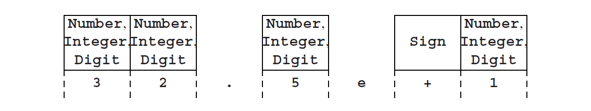
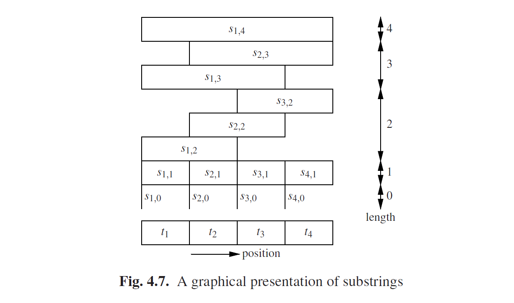

### 4.2.1 普通CF语法的CYK识别

要了解CYK算法如何解决识别和解析问题，让我们看一下图Fig4.6的语法。它描述了科学计算中数字的语法：

这个语法产生的一个句子是**32.5e+1**。我们将把这个语法和句子作为例子。

CYK算法首先重点放在输入句子的子句上，最短的句子优先，然后逐步增加。以下长度为1的子字符串可以直接从语法中读取：

这意味着**Digit**生成**3**，**Digit**生成**2**等等。但是请注意，这个图不完整。一方面，还有其他几个非终结符也可以派生**3**。这种复杂情况出现是因为语法出现了所谓的*单元规则（unit rules）*，像*A→B*这样，其中*A*和*B*都是非终结符。这种规则也被称为*单一规则（single rules）*或者*链规则（chain rules）*。我们在派生中可以得到他们的链。因此下一步重复应用单元规则，例如找出哪些非终结符派生了**3**。这给出了以下结果：

现在我们已经看到了一些我们从语法中识别的组合：例如，跟着一个**Digit**的**Integer**后面接着又是一个**Integer**，跟着一个**Integer**的**.（dot）**后面是一个**Fraction**。我们得到（还是使用单元规则）：

在这点上，我们看到**Real**的规则适用于几种方式，然后**Number**的规则也是，所以我们就有了：

所以我们发现**Number**确实生成了**32.5e+1**。

在上面的例子中，我们就会发现单元规则会使事情复杂化。另一个我们一直避免涉及到的复杂问题，是由ε规则组成的。例如，如果我们想要根据例子语法识别输入**43.1**，我们必须知道这里**Scale**派生出ε，因此我们得到以下图片：

大体来说这样更复杂。我们必须考虑到这样一个事实，即几个非终结符可以在输入句子的任意两个相邻终结符之间生成ε，也可以在句子的开始或者结尾得到。然而，正如我们看到的，这类规则造成的问题是可以解决的，尽管需要花一点代价。

与此同时，我们不应该被这些问题难到。在示例中，我们已经看到CYK算法的工作原理是将非终结符与生成的子字符串对应，优先短子字符串。虽然我们在例子中跳过了它们，但任何输入句子的最短子字符串当然都是ε子字符串。我们必须在任意位置都能识别它们，因此我们首先使用下面的闭式算法计算*Rε*，这是派生了ε的一组非终结符。

集合*Rε*被初始化为一个非终结符*A*的集合，其中*A*→ε是一个语法规则。对于示例语法，*Rε*被初始化为{**Empty**}集。接下来，我们检查每一个语法规则：如果右侧仅包含属于*Rε*的元素，我们就将左侧添加到*Rε*（它派生ε，因为右侧所有符号都是这样）。在例子中，**Scale**将会被添加。这个过程将重复进行，直到没有新的非终结符能添加到集合中。对于该例子，就有了：

*Rε* = {**Empty, Scale**}.

现在我们将注意力集中到输入句子的非空子字符串上。假设我们有一个输入句子*t = t1t2 · · ·tn*，并且我们想要计算非终结符的集合，从位置*i*开始长度为*l*的*t*派生了子字符串的非终结符。我们将使用*si,l*来标识这个子字符串，因此有了：

si,l = titi+1 · · ·ti+l−1.

或者是一个完全不同的符号：*si,l = ti...i+l−1*。图Fig4.7以图形方式展现了这种符号，使用含有4个符号的句子。我们使用*Ri,l*来标识这个派生了子字符串*si,l*的非终结符集合： 

这种标识法可以扩展到处理长度为0的子字符串：*si,0 = ε，Ri,0 = Rε*，对于所有*i*取值。 

因为较短的子字符串是优先处理的，所以我们可以假设我们处于算法中的一个阶段，在这个阶段，所有长度小于某个l取值的子字符串的信息都是可用的。使用这些信息，我们检查语法中每一个右侧，来确定是否派生*si,l*，如下所示：假设我们有一个右侧*A1 · · ·Am*。然后我们将*si,l*分成*m*（可能为空）段，这样*A1*派生第一段，*A2*派生第二段，等等。我们从*A1*开始。如果*A1 · · ·Am*能派生*si,l*，那么*A1*必须派生出它的第一段，比如长度*k*。也就是说，*A1*必须派生*si,k*（属于*Ri,k*），然后*A2 · · ·Am*必须派生剩下的部分：

这是对于属于*Ri,k*的*A1*的每一个*k*的尝试，包括*k*=0。当然，如果*A1*是终结符，那么*A1*必须等于*ti*，而且*k*是1。检查*A2 · · ·Am*是否派生*ti+k · · ·ti+l−1*用同样的方法进行。和Unger方法不同，我们不必尝试所有分区，因为我们已经知道哪个非终结符派生哪个子字符串。

然而，有两个问题。首先，m可以是1，*A1*可以是非终结符，这样我们就是在处理一个单元规则了。这种情况下，*A1*必须派生*si,l*整个子字符串，并因此属于*Ri,1*，就是我们现在正在计算的集合，因此目前我们还不知道是不是这种情况。这个问题可以通过观察*A1*是否派生*si,l*来解决，沿派生的某处必须是第一步而不使用单元规则。因此我们就有了：

A1 →B→· · ·→C$$\overset{* }{\rightarrow}$$ si,l

其中C是派生中第一个使用非单元规则的非终结符。暂时不管ε规则（第二个问题），这意味着在计算集合*Ri,l*的过程中的某一个特定时刻，C将被添加到*Ri,l*中。现在，如果我们一次又一次重复计算*Ri,l*，在某个时刻B将被添加，并在接下来的重复中，*A1*将被添加。所以我们要重复这个过程直到没有新的非终结符被添加为止。这和计算*Rε*一样，是一个闭包算法的例子。

第二个问题是由ε规则引起的。如果*At*中除了一个以外都派生ε，那么我们就有一个基本上等同于单元规则问题的问题。它也需要重复计算*R*的输入直到没有变化为止，那就再次使用闭包算法。

最后，当我们计算了全部的*Ri,l*，识别问题就解决了：起始符号*S*派生*t*（=*s1,n*），仅只有当*S*属于*R1,n*时。

这是一个复杂的过程，这种复杂性的一部分源于ε规则和单元规则。他们的存在迫使我们去重复计算*Ri,l*；这是低效的，因为在第一次计算*Ri,l*之后，重复计算的价值很少。

另一个不太明显但同样重要的问题是，右侧可能由任意多的非终结符组成，并且尝试所有的可能会是一个非常大的工作。如下我们可以看到这点。对于一个有*m*个成员组成右侧的规则，必须找到*m*-1个段端，每个段都与前面所有段结合在一起。找到每一个段端花费*O(n)*步，因为必须扫描与输入长度成比例的l列表；因此找到所需的*m*-1个段端花费*O(nm−1)*步。b并且由于在*R*中有*O(n2)*个元素，因此完全填充它需要*O(nm+1)*，因此在语法的右侧的最大长度上时间要求是指数级的。图Fig4.6的最长的右侧长度是3，因此时间要求是*O(n4)*。这比详尽的搜索要有效的多，后者需要一个输入句子长度呈指数级的时间，这任然是一个让人心惊的时间。

对规则施加一定的限制，可以很大程度解决这些问题。当然，这些限制不能太大的影响到语法的生成能力。