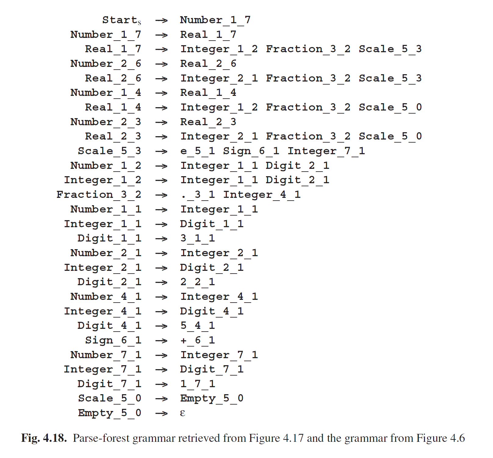
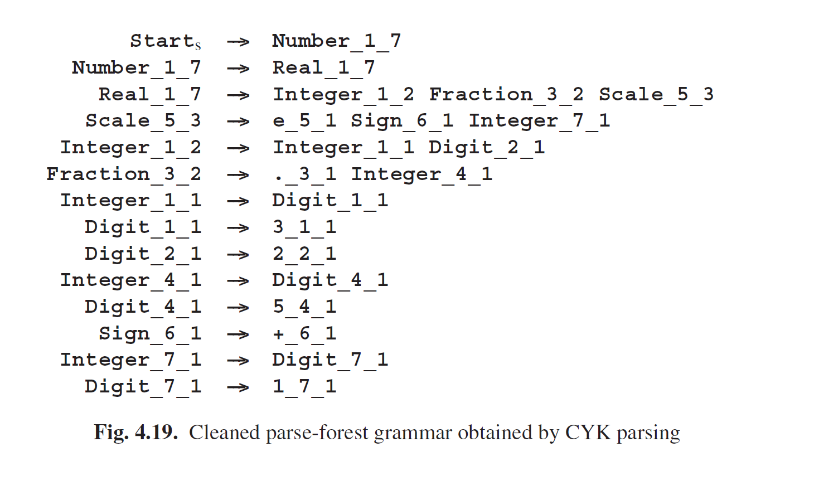

# 4.3 表解析

前面我们已经将CYK识别表绘制成了一个二维三角矩阵，但输入内容（非终结符集合）的复杂性已经表明，这并不是最原始的形式。通过发现CYK识别表是多个表（语法中每个非终结符都是一个表）的叠加可以更简洁有深度；这些输入内容在这些表里面只是*位（bits）*，含义是“Present”或者“NotPresent”。由于图Fig4.6中的数字语法有8个非终结符，因此图Fig4.17的识别表就是8个矩阵的叠加。见图Fig4.20。**Number**表左上角的*点*表示一个长度为7的**Number**已经识别到了位置1；在差不多最右下角的一个*点*表示一个长度为1的**Number**已经被识别到了位置7；以此类推。

想象一下，这8个表就以**Number · · · Empty**的顺序，分隔成一个个单元，然后以队列加入一个单独的块中（*block*）。现在将这个块的顺序颠倒过来。就有了一个新的矩阵*T*，原本的底部成为了现在的顶部，如图Fig4.21，新表的x轴的位置不变，但y轴变成了非终结符的名称和输入句子的长度。例如，左上角*T1,Number*中的数组{1，2，4，7}表示**Number**的长度为这些的生成结果放在位置1。以这种方式为主的解析算法，称为表解析算法（*tabular parsing algorithms*）。很明显，在此转换中，不会新增或删除任何信息，但表解析也有自身的优势和不足。

表*T*在将**1**放入所有输入*Ti,A*（输入中有一个令牌*T*位于位置*i*，且语法为*A→t*）时进行初始化。有两个方法可以填充表的剩余部分，自顶向下和自底向上。