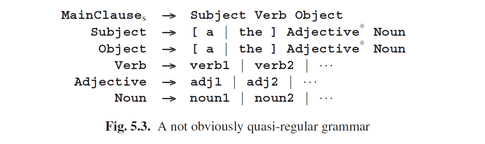

# 5.1.2 拥有无限存储的系统

CF语法（或者更优的）是允许嵌套的。因为原则上来说，嵌套可以是任意多层的，因此产生一个正确的CF句子（或更优）可能需要各种大小的内存来临时存储未处理的嵌套信息。但机械系统中并不会有任意大小的内存空间，因此无法处理CF这样的问题，它只能处理常规性问题。对于像售货机、红绿灯和DVD刻录机等简单机械系统来说，这一点非常明显：它们的运行规律都严格遵照简单的语法逻辑。原则上来说，对于更复杂的机械系统，比如一个国家的火车运行系统或者计算机系统，也是如此。但是这一节中，这一点将不在如此，因为嵌套信息将会明确展示一点内存就可以处理大量的嵌套内容。因此这些系统虽然看起来是严格遵照正则逻辑在运行，但很容易就可以以CF或更强的手段来表示，即便这让人错误的认为这些系统似乎拥有了无限内存。

相反，许多拥有大内存的系统的通用运行也可以用一个正则语法来描述，并且很多CF语法大部分也已经是正则逻辑了。这是由于正则语法也已经充分照顾到了并列、重复和可选性等；嵌套只需要上下文无关。如果我们将生成正则（子）语言的一个规则（并且可以由一个正则规则代替）称为“准正则”，我们可以遵照以下规定。如果该规则的所有选项只包含终结符，那这个规则就是准正则（可选的）。如果一个规则的所有选项只包含终结符和准正则的非终结符以及非递归规则，那这个规则就是准正则（并列）。如果一个规则是递归的，但递归只在可选项的结尾出现且只包含准正则规则，那这个规则依旧是准正则（重复）。这基本已经涵盖了CF语法的大部分了。有关语法中标识所有准正则规则的算法，见Krzemie´n 和 Łukasiewicz [142]。

自然语言就是一个例子。虽然CF或更强的语法似乎有必要描述正确句子集合（并且它们很可能这样做，以抓住某些细微之处），但一个粗略的描述也可以通过正则语言获得。看一下图Fig5.3中Subject-Verb-Object (SVO)语言描述主子句的样式化语法。这个语法就是准正则的：**Verb**、**Adjective**、**Noun**本身是正则的，**Subject**和**Object**是正则形式（正则非终结符以及可选性）的重复的并列，因此也是准正则，因此**MainClause**也是准正则。 将这种语法转换为标准正则形式会有些麻烦，但也不是不能做到，如图Fig5.4所示，其中verbs、adjectives、nouns的列表缩写为**verb、adjective、noun**以节省空间。

甚至（有限）上下文相关语法也可以合并：对于要求verb和subject在数量上一致的语言，我们将第一条规则复制如下：

**
MainClause ---> SubjectSingular VerbSingular Object | SubjectPlural VerbPlural Object
**

并相应的复制其余语法。最终的结果依旧是正则的。嵌套从属子句看起来可能是个问题，但在实际使用中，嵌套的深度往往没有那么大。在英语中，一个包含多重子句的句子，会让读者不知所云，即便是复杂的德语和荷兰语中多层的句子也让人生厌。我们按照所需的次数来复制语法，然后去掉继续嵌套的可能。那么即便是深层次的嵌套也就没那么不正则了。由此产生的语法很庞大但却是正则形式的，就能够使用正则语法适用的简单有效的方法了。所需的重复和修改是机械性的，可以由程序来完成。Dewar, Bratley 和 Thorne [376]描述了这种方法的早期例子，Blank [382]做了最新的论述。