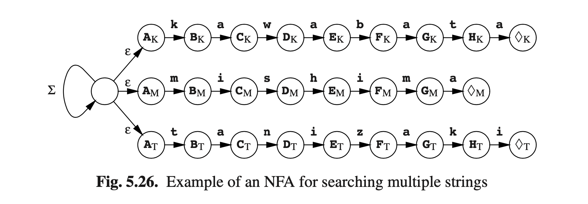

# 5.10 使用有限状态自动机快速文本搜索

假设我们正在寻找一个短文本，例如一个单词或一个名称（被搜索的字符串），在一个很长的文本中例如字典或百科全书。查找长度*n*字符串的一个傻办法是尝试匹配字符串从1到*n*：如果失败，那就整体后移一位即2到*n*+1等等，直到我们找到目标字符串或者直到搜索完全部字符串。但是这个方法耗时极高，因为每个字符都要过*n*次搜索。

有限自动机提供了一个更有效的文本搜索方法。我们从字符串中生成一个DFA，让它来操作字符串，让它遇到一个可接受状态时，那么就找到目标字符串了。例如，假设搜索字符串是**ababc**，且文本仅包含**a**、**b**和**c**。搜索此字符串的NFA如图Fig5.24（a）所示；推导过程见下面。

文本中的每个字符串都有两种可能路径：如果搜索从这里开始，那该字符串由右向状态练表示；或者搜索不从这里开始，那我们就要跳过现在的字符并回到初始化状态。自动机是非确定性的，因为我们可以在状态**A**中找到**a**，那我们就有两种选择：这是**ababc**这个字符串在全文开始的位置，或者认为它不是。

使用传统的方式，那这个NFA可以用来生成一个状态树 *（b）*和一个DFA *（c）*。图Fig5.25展示了DFA在输入文本**aabababca**后的状态转换过程。可以看到，我们实现了*超字符串识别（superstring recognition）*，即输入的子字符串被识别为匹配的是语法而不是输入。这使得输入成为该语言的字符串中的一个超级字符串，因此而命名。

这种有限状态自动机的应用被称为*the Aho and Corasick bibliographic search algorithm*（Aho and Corasick [141]）。与任何DFA一样，每个字符只需要几个计算机指令。一个额外的收获是，对多个字符进行搜索的消耗与单个字符相当。与图Fig5.26对应的DFA将同时搜索**Kawabata**,**Mishima**和**Tanizaki**。注意，有三个不同的可接受状态，$$\lozenge_{K}$$，$$\lozenge_{M}$$和$$\lozenge_{T}$$。

The Aho and Corasick算法不是字符串搜索的最后一个。同样优秀的算法还有the Rabin-Karp algorithm (Karp and Rabin [145])和the Boyer-Moore algorithm (Boyer and Moore [143])。Aho [147]提供了快速字符串搜索算法的极佳概述。Watson [149]扩展了Boyer-Moore算法（它只能搜索单个单词），使之可以搜索正则表达式。但是无论这些算法有多么棒，它们都不在本书的范围之内，因此大家可以自己去研究，本书不做探讨。