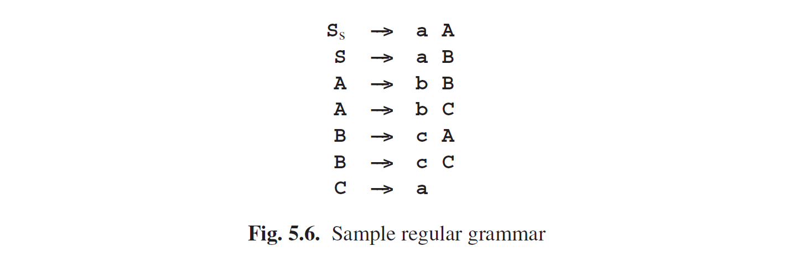
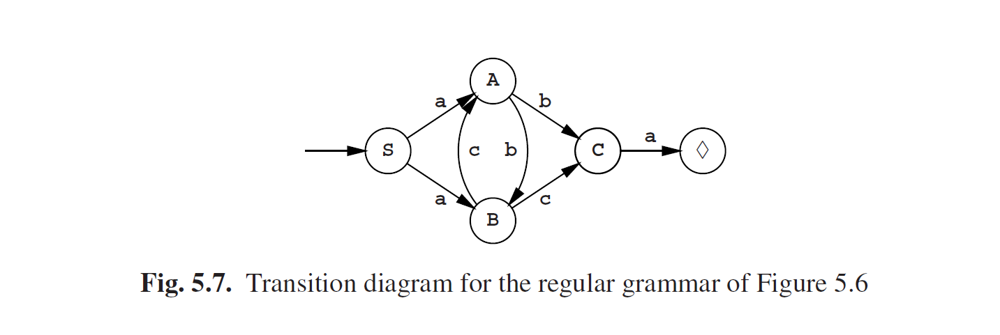
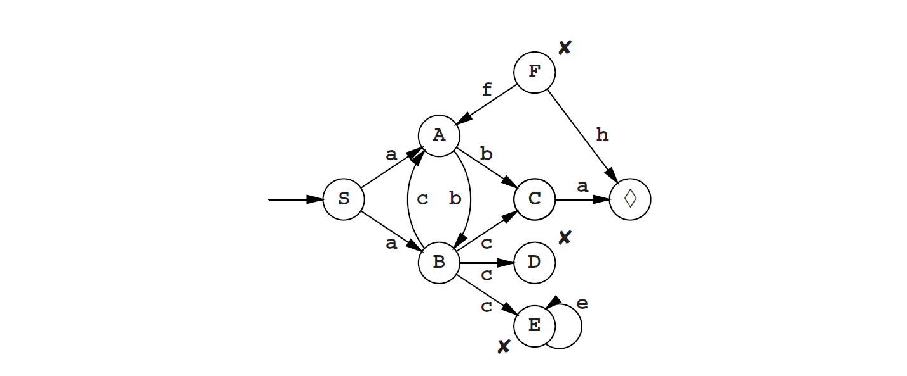

# 5.2 正则语法的生成物

当从正则语法生成时，生产者需要记住一点：下一个非终结符是哪个。我们将用图Fig5.6的简单正则语法来说明这一点以及证明更进一步的概念。此语法生成一个由**a**组成的句子，后面跟着**b**和**c**交替序列，最后由一个终结符**a**结束。到目前为止，我们的讨论都限制在标准符号的正则语法范围；接下来我们将扩宽我们的视野以寻找更便捷的形式。

生产者标记的非终结符称为它本身的状态，并且该生产者被认为就是处于该状态。当生产者处于给定状态（例如**A**）时，它会选择属于该状态的一个规则（例如**A--->bC**），生成**b**之后状态变为**C**。这种变化称为状态转移，对于规则*P→tQ*写作*P $$\overset{t}{\rightarrow}$$ Q*，一个右侧没有非终结符的规则（例如**C--->a**），对应的状态转换到一个可接受状态；对于规则*P →t*将写作*P $$\overset{t}{\rightarrow}$$ $$\lozenge$$*，其中$$\lozenge$$就是可接受状态。

在*转换图（transition diagram）*中，通常将状态和生产者可能的转换过程组合在一起。图Fig5.7展示了图Fig5.6的正则语法的转换图；例如我们看到**A $$\overset{b}{\rightarrow}$$ C**的状态转换在图中表示为由**A**指向**C**的一条标记**b**的弧线。**S**是初始状态，而可接受状态标记了一个$$\lozenge $$[^1]。弧线上的符号是在相应转换时产生的。当生产者处于可接受状态时，就可以停止了。

如3.3节我们所见的非确定性自动机，生产者也是一个自动机，或者更确切的说，是非确定性有限状态机、*NFA*或*有限状态机（finite-state automaton）*FSA。称之为“有限”，是由于它只能处于有限的状态中（本例是5种状态；3位（bits）存储就够了），“非确定性”是由于在状态**S**种由不止一种方式来生成**a**。

正则语法可能存在非确定性、非生产性或者非终结符等就像上下文无关语法一样的状况，我们对其所做的分析甚至可能更容易可视化。如果图Fig5.6的语法与下面的规则一起扩展：

我们将获得下面的转换图：

从中我们能看出**D**不会产生进一步的转换，也就是说**D**是无定义的；虽然**E**是有定义的，但也没有产生其他的；而F没有指向其的箭头。

与预处理CF语法时相同的算法（2.9.5节）也可以用来预处理正则语法。与CF语法不同的是，正则语法和有限状态机可能更小：对于给定的FS状态机A，可以构造出具有最少状态数但同样可以识别与A相同语言的FS状态机。在5.7节将会给出一个可以做到这样的算法。

[^1]: 另一种标记可接受状态的方式是围绕它绘制一个额外的圆；由于我们也需要显示标记不可接受状态，在此我们不采用这个方式。