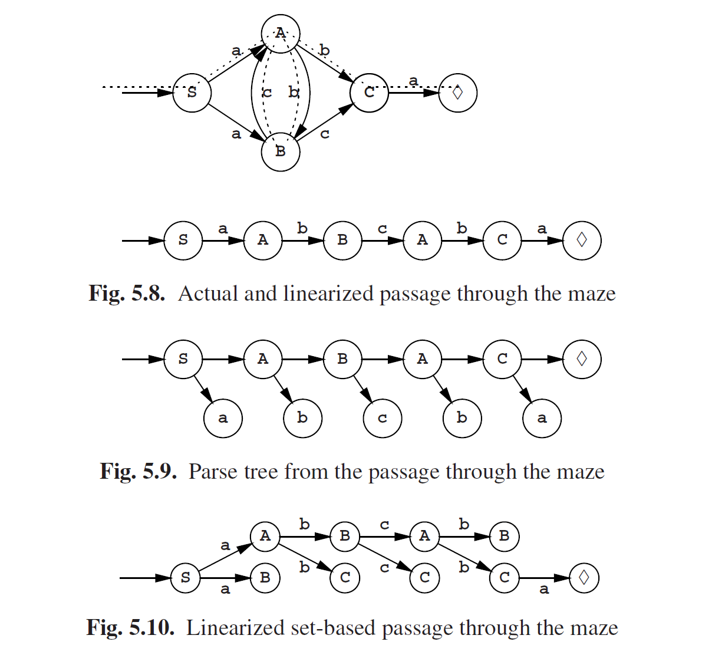

# 5.3 使用正则语法进行解析

上述用于生成句子的自动机原则上也可以用于解析。假如我们有一个句子，**abcba**，然后我们想要检查并解析它，那么我们就可以将上面的转换图视为一个迷宫，然后句子（中的令牌）视为一个向导。如果我们设法找到一条穿过迷宫的路径，那就将我们检查过的句子中的符号与迷宫墙上的标记匹配起来，并在末尾以♦结束。如图Fig5.8，其中路线显示为虚线。我们访问过的空间是解析树的主干，如图5.9所示。

但是找到正确的路径，说起来容易做起来难。例如，我们怎么知道在**S**处应该左转而不是右转？当然我们可以采取惯常的迷宫解决法（时间消耗为指数级），但其实有一个更简单高效的方法：我们兵分两路，各走一边。在句子**abcba**的第一个**a**之后，我们就有了两个空间集合 **{A,B}** 。接下来是**b**；**B**之后没有**b**了，但是**A**之后还有两个选择**B**和**C**。因此我们有了集合 **{B,C}** 。我们的路径现在更难描述了但是依旧还是可以线性化，如图5.10所示。

我们可以通过从末尾开始，向后指针向前指就有了：**♦ <--- C <--- A <--- B <--- A <--- S**。如果语法不明确，那这样的方法指针可能会将我们带到错误的方向：已经发现的歧义处必须单独处理以得到两条路径。但是对于正则语法，人们通常没兴趣去解析它，而只对识别感兴趣：输入正确并在适当的地方结尾，这就够了。