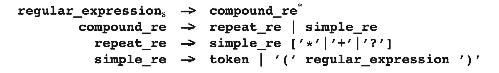
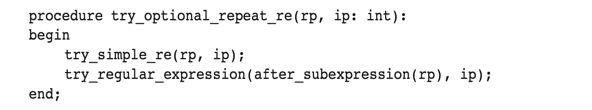

# 5.8.1 识别器

自上而下的识别器遵循正则表达式的语法，总结如下：

识别器保留了两个指针，一个在正则表达式中一个在输入中，并尝试同时移动两个指针：当有一个令牌匹配时，两个指针同时向前一步，但是如果**simple_re**必须重复一次时，正则表达式的指针要向后一步，且输入指针保持原位。当正则表达式指针指向正则表达式末尾时，识别器根据输入指针的移动距离来之策一个匹配项。

当识别器尝试识别**compound_re**时，首先会判断它是否是**repeat_r**。如果是的话，它会检测标记。如果标记是 **+**那表示必须要有**simple_re**，则识别器接下来会先查找**simple_re**，但如果**simple_re**是可选项（即标记为 **\*、?** ），那么接下来的查找分为两条路：一条查找**simple_re**，另一条查找正则表达式的这个**repeat_re**之后的其余部分。当识别器完成一个**repeat_re**之后，接下来它会继续查找标记。如果是一个 **?**，那么继续，但如果是 **\***或者 **+**，那么查找又分为两条路：一个跳回**repeat_re**的开头，一个继续搜索剩下的正则表达式。

如果识别器发现**simple_re**是一个令牌，会将这个令牌和输入指针的令牌进行比较。如果他们匹配，那么两个指针都向前移动；如果不匹配，那么搜索终止。

还有两个问题：我们如何实现搜索拆分，以及如何处理记录下来的匹配项。第一个问题，我们通过按顺序执行来实现搜索拆分：我们先执行完整的首次搜索直到结束或者失败，包括所有的子搜索；然后，无论结果如何我们都进行第二次搜索。这看起来有些麻烦，无论是编码还是效率，但实际上并不会。选项**repeat_re**的核心代码如下：

其中rp和ip代表正则表达式指针和输入指针。该算法通常很高效，因为搜索几乎都是立马失败，因为两个令牌并不匹配。

记录的匹配项的处理取决于应用程序。如果我们想知道正则表达式是否匹配整个字符串，例如文件名匹配，我们就看看是否同时到达输入的结尾处，如果同时到达，那么直接返回成功；如果不是同时到达，那么就继续搜索。如果我们想要的是找到最长匹配项，那么我们就将每个匹配项的长度记录下来，然后进行搜索直到所有搜索都结束。