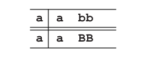
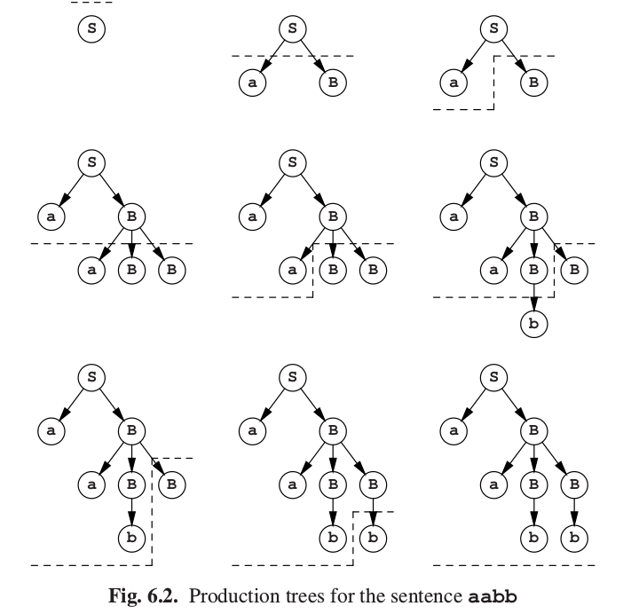

# 6.1 仿最左推导

现在让我们用一个例子解释这样一个推导过程。如图Fig6.1所示语法。这个语法生成与**a**和**b**数量相同的句子。

让我们从开始符号**S**开始尝试解析句子**aabb**。**S**是我们的第一个预测.我们的预测的第一个符号是非终结符，所以我们要用它的一个右侧替代它。在这个语法中，**S**有两个选择：我们或者用规则**S&rarr;aB**，或者用规则**S&rarr;bA**。句子从**a**开始而不是**b**，所以这里我们不能用第二个规则。应用第一个规则我们得到预测**aB**。现在预测的第一个字符是一个终结符。因此，我们别无选择：

我们要将这个字符和句子的当前字符做匹配，这里当前字符也是**a**。因此我们获得了一个匹配项，并接受**a**。余下的句子就留给我们一个预测**B**：**abb**。预测的第一个字符又是一个非终结符，所以要被它的一个右侧代替。现在我们有三种选择。然而，第一和第二个选择在这里不适用，因为它们由**b**开始，但实际上我们需要的是**a**。所以，我们采用第三个选择，现在我们有了预测**aBB**：

因此对于当前输入字符我们再次有了一个匹配项，所以我们接受它，然后继续**bb**的预测**BB**。我们要再次用其右侧替代其最左的**B**。句子的下一个字符是**b**，所以这里第三个选择不适用。这仍然留给我们两个选择：**b**和**bS**。所以我们可以两个都尝试，但也可以用更聪明一点的方法。如果我们采用**bS**，我们至少会得到一个额外的**a**（由于**S**），所以这不可能是正确的选择。因此我们只能选择**b**，于是得到了对应**bb**的预测**bB**。我们再次得到了一个匹配项，这留给我们**b**的预测**B**。由于同样的原因，我们选择**b**。匹配之后，我们的预测为空。幸运的是，我们同时到达了输入句子的末尾，所以我们接受了这个输入。如果我们记录下了使用过的生成规则，就能得到下面的推导过程：
    
**S&rarr;aB&rarr;aaBB&rarr;aabB&rarr;aabb**

图Fig6.2用树的形式展现了解析的步骤。图中的虚线将已经处理过的部分和未处理部分分开。整个过程中，预测的最左侧符号都经过了处理。

这个例子显示了本章讨论的解析器的几个共同点：

- 我们总是对预测中的最左符号进行处理

- 如果这个符号是终结符，我们就没有其他选择：我们只能将它和当前的输入字符匹配，或者直接拒绝解析

- 如果这个符号是非终结符，我们需要采用一个预测：它需要被它的一个右侧替代。因此，我们总是先处理预测中的最左符号，从而得到了最左推导。

- 所以，自顶向下方法将解析树的节点用前序组织：父节点总是在它的子节点之前被识别。