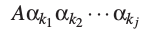
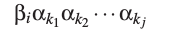
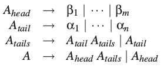
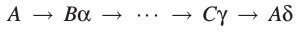
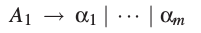

# 6.4 左递归的消除

我们先讨论消除直接左递归的方法。假定ε规则和单元规则已经被消除了（见4.2.3.1节和4.2.3.2节）。现在，使*A*为一个左递归规则，并且

是*A*拥有的所有规则。没有等于ε的αi，否则我们会有*A→A*规则和一个单元规则。也没有等于ε的βj，否则会有一个ε-规则。由*A*生成的句型只用*A→Aαk*规则，这些句型都有这样的形式：

并且当A→βi规则使用时，句型不再以A开头，对一些i，和一些k1,...,kj,它有如下的形式：

这里j可能为0.同样的句型也可以用如下规则生成：

或者，不重新引入ε规则生成的话就是这样：

这里*Ahead*,*Atail*和*Atails*是新引入的非终结符。所有αi都不是ε类型，所以*Atail*不会推导出ε，所以*Atails*不是左递归。不过*A*可能仍然是左递归的，但不是直接左递归，因为没有*βj*是以*A*开始，然而它们却可能推导出以*A*开始的句型。

一般来说，消除间接左递归要更复杂。思路就是先将非终结符标号，标为*A1,A2,...,An*。那么，对一个左递归非终结符A，就有如下推导

任何时刻句型的最左边都是非终结符，然后每次使用其中一个右侧替代。每一个非终结符都有一个标号，计作*i1,i2,...,im*，于是在推导中我们得到了这么一串数：*i1,i2,...,im,i1*。现在，如果我们没有任何包含*jα(j&le;i)*的规则*Ai→A*,那这就是不存咋的，因为*i1&lt;i2&lt;...&lt;im&lt;i1*是不存在的。

现在就要消除这种形式的规则。我们从*A1*开始。对*A1*，要消除了只是直接递归的规则，我们已经看到了应该怎么做。接着轮到*A2*。每一个有着*A2→A1α*形式的产生式都要被替代成如下：

这里*A1*的规则为

这不可能产生*A2→A1γ*形式的新规则，因为我们已经消除了*A1*的左递归规则，而且*αi*都不为ε。接着，我们来处理*A2*的直接左递归规则。这样对*A2*的工作就结束了。同样，我们对*A3*到*An*进行处理，按照总是先替代*Ai→A1γ*,再*Ai→A2δ*等的顺序。我们必须按照这样的顺序，因为替换一个*Ai→A2δ*的规则可能会引入一个*Ai→A3γ*规则，而不是*Ai→A1α*规则。