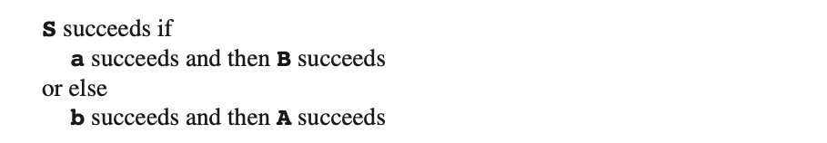
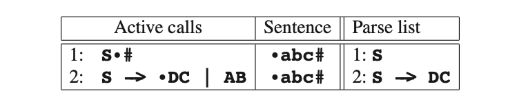
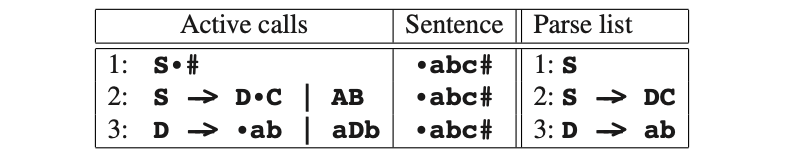
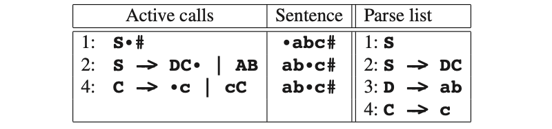
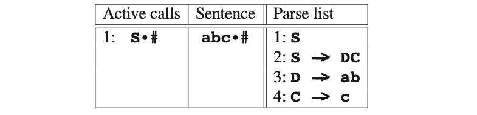

# 6.6.1 一个纯粹的方式

作为第一种方法，我们把语法规则视为识别其左侧的程序。

**S -> aB | bA**

上面这样的规则被视为识别**S**的程序。过程如下：

这与语法规则没有太大区别，但它看起来也不像一个程序。就像菜谱一样，上面不会告诉我们要削土豆皮，更不会教我们怎么削皮，所以有一些过程是被省略的。

当执行此类程序时，我们需要保留部分信息。首先，规则中有“当前位置”（指针）的概念。这个当前位置指向了下一个内容。当我们将规则视为程序执行时，程序计数器会自动维护当前的位置，它显示了我们当前在程序中的位置。接下来是输入句子本身。当使用回溯解析器时，我们通常将句子保存在一个全局数组中，句子中每个符号都有一个元素与之对应。这个数组必须是全局的，因为它包含的信息必须在所有进程中都可以访问。

然后是输入句子的当前位置（指针）的概念。当规则中的指针指向终结符，并且这个符号对应输入句子的指针的符号时，两个指针都前移一位。输入句子中的指针也是全局性的。因此我们将在全局变量中保存这一指针。此外，当开始一个规则时，我们必须记住输入句子的当前位置，因为我们需要它来执行“or else”条件句。这些必须从输入句子的同一位置开始。例如，从图Fig6.1语法的**S**规则开始，假设**a**与输入句子当前位置的符号匹配。当前指针向前一步，然后尝试**B**。对于**B**有一个与**S**相似的规则。现在假设**B**失败了。那么我们就要尝试**S**的下一个选择，并将输入句子中的指针退回到我们开始的位置。这就是回溯，与前面我们所见一样。

这一切都告诉我们如何用程序处理一个规则。但是，我们处理的语法通常都有多个非终结符，因此会有多个规则。当我们在程序中遇到一个规则的非终结符，我们就必须要调用该非终结符的程序，并且如果调用的程序执行成功，则返回当前调用并继续执行。我们实现这个自动性通过使用实现语言的程序的调用属性。

另一个我们还没注意到的细节，是我们必须记忆我们使用的语法规则。如果我们不记录它们，后续我们就无法知道这个句子是如何产生的。因此，我们用“Parse list”来记录它们，如果失败则会被移除出列表。每一个程序都必须保留自己在此列表中的索引副本，因为我们同样需要它来执行“or else”条件语句：如果选项失败，那其后续操作都将终止。

最后要填充的细节涉及到解析器的启动方式：通过调用起始符号的程序来启动。当该过程成功，且下一个符号是终结符时，接戏列表中留下的语法规则展示了句子的最左推倒。

现在我们看看上面描述的解析器是如何工作的。我们在以图Fig6.6为例，输入句子为**abc**。我们从**S**的调用开始，接下来是 **#**的检查，输入扩展为 **#**，以及仅由**S**的节点组成的Parse列表。

我们的管理程序分为三部分。“主动调用”部分是程序主动调用，每次调用都会有一个点(•)来表示当前位置。这部分的地步规则就是当前的活跃程序。“句子”部分代表句子，包括指示在句子中当前位置的位置标记。“解析列表”（“Parse list”）将用于记录我们使用的规则（不仅仅是当前活跃的规则）。此列表中的条目已经编号，并且“主动调用”的每一个条目在Parse列表中包含了它的索引。我们稍后将看到，对于选择错误选项后的回溯过程这是必须的。

最初只有一种可能性：在活跃调用中的当前位置表示我们必须调用**S**的程序，那我们来试试：

请注意，我们在**S**的调用中已经前移了位置。它现在表示的是当我们完成**S**的调用后应该开始的位置：点表示返回地址。现在我们尝试**S**的第一个备选项。这里有一个选择，因此输入句子的当前位置被保存起来。我们在图片中没有明确说明这一点，因为此位置已经出现在引用**S**的条目中的“句子”部分。

现在**D**的第一个选择已经尝试过了。**a**成功了且接下来**b**也成功了，因此我们就有了：

现在**D**的选项已经进行到最后了。这意味着**D**的程序调用成功并且有返回值。自爱更新上述条目的当前位置后，我们将该条目从活跃调用列表中删除。接下来，调用到**C**：

如上**c**成功了，因此**C**也是成功的，接着**S**也成功了：

现在#s可以匹配，因此我们找到了解析，且Parse列表部分表示了句子的最左侧推导：

**S -> DC -> abC -> abc**

此方式成为*递归下降*，“下降”指的是从上至下的操作路径，“递归”是由于每个非终结符都可以直接或间接（通过其他程序）调用自己。要强调的是，“递归下降”只是指执行方面，尽管是非常重要的一个方面。还有一点需要强调的是，上面描述的解析器是一个回溯解析器，独立于使用的方法。可回溯性是解析方式的一个属性，也不是实现方法。

上面的回溯方法是令人满意的，因为我们实际上将语法本身作为一个程序：实际上我们可以将语法规则自动转换为程序，如下所示。只有一个问题：上面讲到的递归下降并不总是起作用。我们已经知道它并不适用于左递归语法，但问题比这严重。例如，**aabc**和**abcc**就是无法识别但实际应该被识别的句子。解析**aabc**时在第一个**a**之后就卡住了，解析**abcc**时在第一个**c**之后会卡住。然而可以这样导出**aabc**：

**S -> AB -> aAB -> aaB -> aabc**

而**abcc**可以如下推导：

**S -> DC -> abC -> abcC -> abcc**

那么我们来研究一下我们为什么失败。稍加分析就能发现在解析**aabc**时，我们从来没有尝试过**A->aA**，因为**A->a**是成立的。同样在解析**abcc**时我们也没有尝试过**C->cD**，因为**C->c**是成立的。每当不止一个右侧能成立时，就会出现这样的问题，而每当右侧出现从同一个非终结符的另一个右侧可以生成一个字符串的前缀时，就会出现这种情况。之所以会出现这样的情况，是因为我们假定如果有成功的选项，那么它就是正确的选项。而当它不是唯一选项时，它也不允许我们回溯。那么当语法有ε规则时就会导致严重的问题，因为ε规则总是成立的。无法回溯的另一个问题是，我们无法得到全部的解析，当解析不止一个时（这对非确定性语法来说是极有可能的）。

我们当然需要改进。我们用以确定是否正确的标准显然是不完善的。回顾本节开头的回溯解析器，我们看到该解析器并没有这个问题，因为它不独立于上下文来做出选择。当一个选择最终能带来正确的解析时才能说明选项是正确的；并且即使选项最终可以成功，我们也要尝试其他的选项以便我们能得到全部的解析。在下一节中，我们将讲述一个可以解决上述所有问题的递归下降解析器。

同时，上述方法只适用于*无前缀*的语法。非终结符*A*时无前缀的，如果它不产生两个不同的字符串*x*和*y*，且一个是另一个的前缀。如果所有非终结符都是无前缀的那么该语法才是无前缀的。对于上述算法，这意味着在输入字符串中特定位置识别A的尝试永远也不会有多余一种方式能成功，因此当第一个识别失败后，不需要返回并尝试另一个选项，因为不会存在可以成功的选项了。
