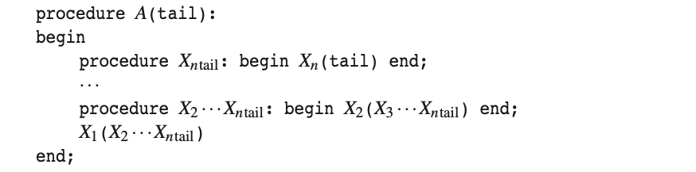
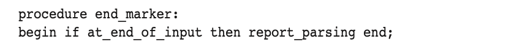
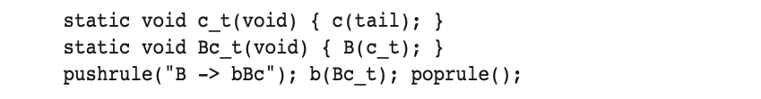
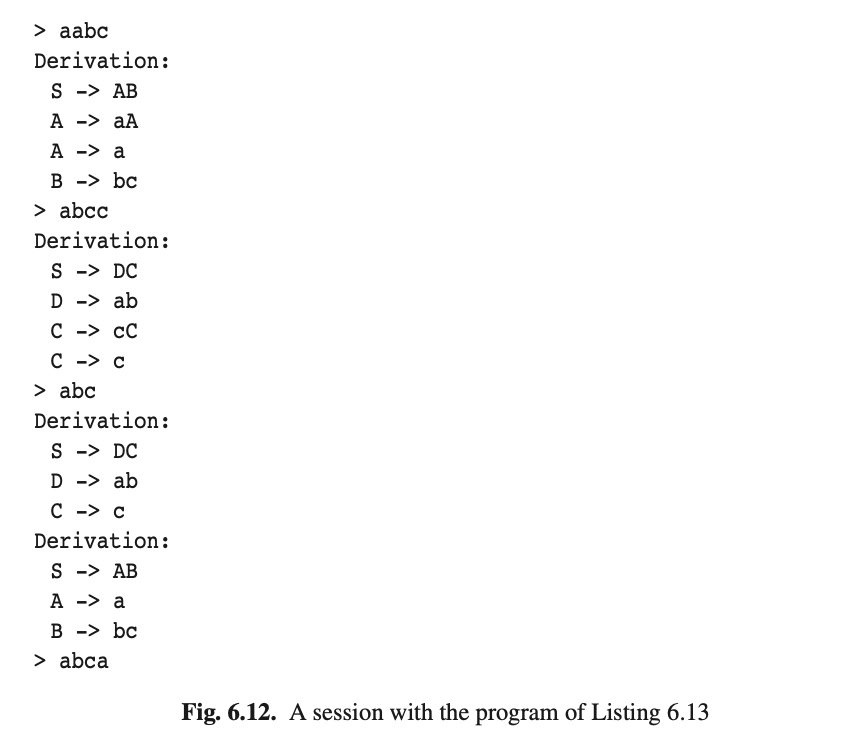

# 6.6.2 穷举回溯递归下降

在上一节中，我们看到我们必须小心不要过早做出选择；只有当能到达一个成功地解析结果时才应该被选中。现在，这个要求很难用递归下降解析器来表达了。那我们如何能得到这个可以告诉我们是否能带来成功解析的过程呢？原则上是有无限多个的，每个哨兵模式（预测）都有一个，且必须可以推导出剩余部分，但我们不需要把它们都写下来。然而在解析过程中的任意时刻，我们只能处理一个哨兵：即当前的预测，因此我们可以尝试在解析期间动态地为这种感知形式构建一个解析过程。一些编程语言为此提供了有用的工具：过程参数。通过过程参数，一个过程就可以接受另一个过程（甚至是同一个过程），通过参数传入并调用，或将它传给另外一个过程。

现在我们来看看如何在符号*X*的解析过程中使用过程参数。*X*的这个过程传递的是一个*tail*程序，作为解析句子剩余部分的，即*X*后面的部分。这个过程被称为*延续*，因为这体现了要完成的工作的延续。因此*X（tail）*的调用将解析整个*X*，通过先解析*X*然后在调用*tail*来解析剩余部分。这是所有非终结符所采用的方式，同时到目前为止也适用于终结符。

对于终结符*a*的解析相对简单：只需尝试将当前输入的符号与*a*进行匹配。如果成功了，那么位置前移一位，并调用*tail*参数；然后当*tail*有返回时，则恢复输入位置并返回。如果失败那么直接返回。因此*a*的抽象代码如下图，其中输入存放在数组*text*中，输入位置存放在变量*tp*中。

非终结符*A*的解析过程相对复杂。最简单的情况是*A → ε*，它是通过对tail的调用实现的。其次简单的情形是*A → X*，其中既不是终结符也不是非终结符。为解决这种情况，我们必须记住，我们假设对*X*有一个解析程序，因此这个程序的实现包含了对*X*的调用，以及*tail*参数。

在下一种情况是*A → XY*。*X*的解析程序需要一个“*X*之后有啥”的解析程序作为参数。而此处这个入参程序内置于*Y*及其*tail*程序中：我们在这两者之外重新创建的一个新的程序。这本身就是一个简单的程序：它调用*Y*，以*tail*为参数。如果我们调用*Ytail*，那我们可以通过将*Ytail*作为参数调用*X*来实现*A*的解析程序。因此规则*A → XY*的抽象代码为：

最终，如果右侧包含两个以上的符号，那这个过程就得递归进行：对规则*A → X1X2 ···Xn*，我们创建一个程序来调用*X2 ···Xn*及*tail*，而*tail*又需要一个调用*X3 · · · Xn*及其*tail*的程序...因此规则*A → X1X2 ···Xn*的抽象代码如下：

此处的*X2···Xntail*和*X3···Xntail*等只是新程序的名称。我们看到在程序*Xn*在开始时的预测栈是由*X1, X2 ···Xn*和*tail*的调用来展示及编码的。

最终，如果我们有一个具有*n*个选项的非终结符，即*A → α1|···|αn*，那么*A*的解析程序就有*n*个连续的代码段，根据上面的抽象代码。它们都在最底层调用*tail*。

如果将此技术应用于所有的语法规则将会产生一个解析器，只是我们还没找到入口在哪。这很容易想到：我们只需调用起始符号的程序，并将结束标记作为参数传入。

结束标记的程序与其他是不同的，因为这是最终确定我们的尝试是否成功的程序。它需要测试我们是否已经到达输入的末尾，是则返回我们已经找到了一个解析；由于它没有参数，因此不会在继续调用其他*tail*。它的抽象代码如下：

规则*A → X1X2 ···Xn*的抽象代码，声明了辅助程序*X2 ···Xntail*到*Xntail*是作为*A*的本地程序的。这是必须的，因为*tail*必须可以从*Xntail*访问，而唯一可从中访问*tail*的作用域位于*A*的程序内。因此要在实践中使用这种编码技术，我们就需要有一种可以在本地运行并允许其作为参数传递的编程语言；不幸的是当今世界几乎没有这样的语言存在。唯一存在可能的是GNU C以及函数式语言。GNU C是C语言中一个被广泛使用的扩展，并在下面的代码中使用；函数式语言编写的解析器将在17.4.2节中介绍。该技术也可以在没有本地程序的语言中使用，但需要一些技巧；见问题6.4。

列表6.13和6.14为图6.6的语法提供了一个穷举回溯递归下降解析器，用GNU C编写。该程序有一种机制来记忆所使用的规则（列表6.14中的程序*pushrule()*和*poprule()*），因此可以将每个成功地解析打印出来。例如规则**B->bBc**的代码为：

我们也使用的GNU C的特性来混合声明和语句。

图6.12展示了此程序的会话。注意对于错误输入**abca**是没有给出错误信息的；最终解析器找到0个解析。

由此可见，我们可以通过解释语法来执行递归下降，如6.6.1节，或生成代码并编译来实现，如6.6.2节。将他们区分一下，第一种方式称为解释递归下降，第二种方式称为编译递归下降。