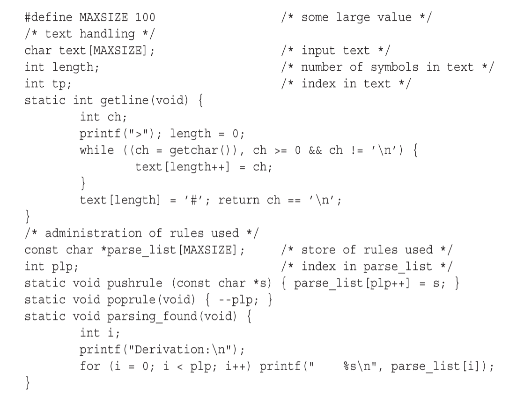

# 6.6.3 广度优先递归下降

Johnstone和Scott [36]提出了一种不同的穷举递归下降方式，称为*广义递归下降解析（Generalized Recursive Descent Parsing (GRDP)）*。与6.6.1节的本地程序一样，它为每个非终结符提供一个单独的解析程序。但是非终结符*A*的GRDP程序不是在找到匹配项后立马返回（这就是导致本地程序失败的原因），而是持续跟踪所有的匹配项，最终返回从当前位置开始并且匹配*A*输入长度的所有匹配项集合。如果没有找到匹配项，则集合为空。

此类程序的调用者（可能正在处理*A*的右侧）必须为此做好准备，并在尝试处理右侧的其余部分时依次处理每个长度。最后，起始符号程序的调用者应该检查输入的长度是否包含在返回集合中。

有以下语法：

**SS --->A a b**

**A--->a A a | ε**

以及输入字符串**aaaaaaab**，**A**路由的调用者**S**将返回长度0,2,4,6，而只有长度6能使得**S**可以解析余下的**ab**。**A**路由中的事件更为复杂。在匹配第一个**a**之后，程序将会调用自身返回长度0,2,4,6。它将逐一尝试每个长度去匹配**a**；0,2,4可以成功匹配，而6则失败了。匹配后将产生长度2,4,6。**A--->ε**选项带来了长度0，而返回给**S**的集合为{0,2,4,6}。

每个程序都返回所有可能的匹配项这一事实，使得我们将此方法称为广度优先，尽管该方法也有深度优先的属性。因为在检查下一个右侧符号之前，总是会先深入查询非终结符当前的右侧符号。

该方法适用于所有非左递归CF语法，并可以进行优化，以便与LL(1)语法或非左递归LR(1)语法解析器进行对比。该方法在免费提供的解析器生成器中实现；见Johnstone与Scott [363]。