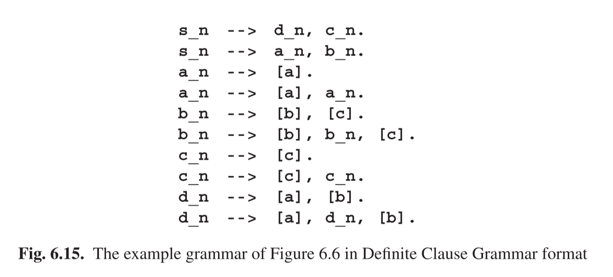

# 6.7.2 DCG格式

Many Prolog systems allow us to specify grammars in a format that differs from the usual Prolog clauses. Since Prolog clauses are sometimes called definite clauses,a grammar in this format is called a Definite Clause Grammar, often abbreviated to DCG. The DCG form of the grammar of Figure 6.6 is shown in Figure 6.15. There is a DCG predicate for each non-terminal and a DCG clause for each grammar rule. Since predicate names have to start with lower case letters in Prolog, we have translated non-terminal names like S by predicate names like s_n,for“S-non-terminal”.The terminal symbols appear as lists of one element.

The Prolog system translates these DCG rules into Prolog clauses. The idea is to let each DCG rule for a non-terminal A correspond to a Prolog rule with two logic arguments of type list, traditionally called Sentence and Remainder, such that the rule

A_n(Sentence, Remainder):- ...

 means that the character list Sentence is equal to whatever this rule for A produces concatenated with the character list Remainder.

More in particular, the DCG rule d_n-->[a],[b]. corresponds to the Prolog clause 

d_n(S,R) :- symbol(S,a,R1), symbol(R1,b,R).

where we have abbreviated Sentence to S and Remainder to R. The predicate symbol() is defined as

symbol([A|R],A,R).

This is a form of the Prolog predicate definition in which the condition lies in the matching of the arguments only: the predicate symbol(S,a,R1) succeeds when S can be split into two parts, A and R, such that A matches a and R matches R1, in short when there is an R1 such that S=aR1. Likewise the predicate symbol(R1,b,R) tries to find an R such that R1=bR. Together they enforce that S=abR,which is exactly what the DCG rule d_n-->[a],[b]. means.

This technique can be extended to more than one intermediate logic variable, as, for example, in the translation of the second DCG rule for d_n:

d_n(S,R) :- symbol(S,a,R1), d_n(R1,R2), symbol(R2,b,R).

Here the Prolog system will have to find instantiations of two logic variables, R1 and R2 such that S=aR1, R1=P(d_n)R2,and R2=bR,where P(d_n) is any terminal production of d_n. When we combine these equations we obtain the semantics of d_n(S,R) as described above: S=aP(d_n)bR. (Most Prolog processors use a much less readable format internally.)