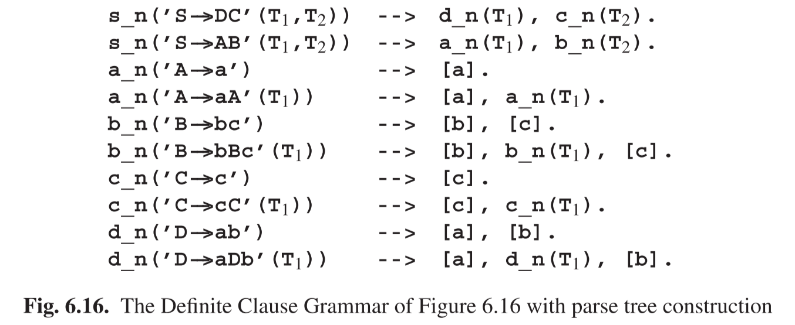
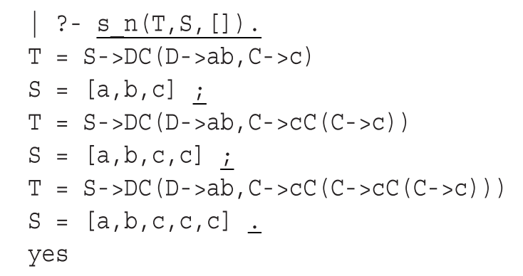
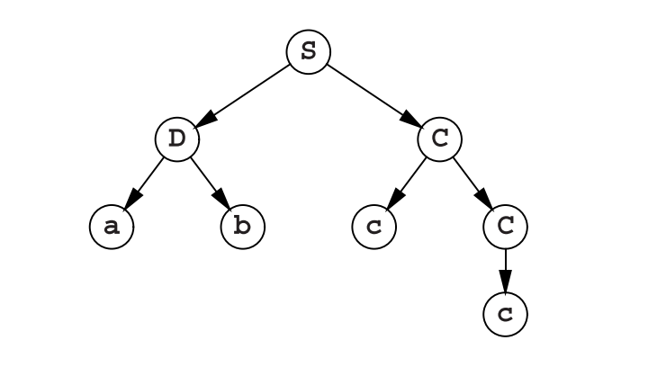
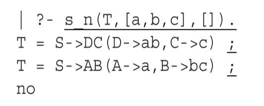
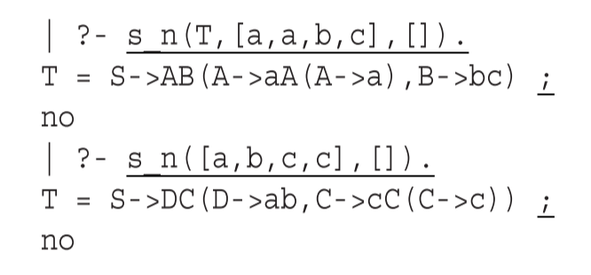

# 6.7.4 运行有限子句语法程序

图6.16的DCG程序可以加载到Prolog解释器中，然后我们就可以如上述那样提交查询了。在编写这些查询语句时，我们应该了解到语法的根S对应DCG的名称s_n(T)，其中T是解析树；而对于一个Prolog来说则是一个预测词，其中S是子句而R是剩余部分。这里介绍的程序是运行在C-Prolog1.5版本上的。

首先我们希望DCG程序能生成一些句子及其解析树。为此我们将两个未实例化的变量**S**和**N**传递给**s_n**，并请求系统查找三个实例（用户输入用下划线区分计算机输出）：

我们看到系统只会生成一个句子**S**，就是以**a**开头后面是**b**然后是不断增加的**c**。Prolog系统使用深度优先搜索算法机制，而这并不适合用于生成句子（参见第2.4节，我们使用广度优先方法）。**T**的值展示了其对应的解析树；每一个的顶部都是规则**S--->DC**，以及描述其两个子节点的组件。需要注意的是，在这里**S--->DC**是作为名称使用，因此**S--->DC(D--->ab,C--->cC(C--->c))**应该描述为**'S->DC'('D->ab','C->cC'('C->c'))**，对应的解析树是

接下来，我们让系统识别一些句子；我们就用6.6.1节的例子**abc**来试试：

完整的回溯解析器会纠正对输入句子的解析，同事还提供第二种解析方案，这是普通回溯解析器所没有的。第三个**no**则说明没有其他可能的解析存在了。

最后我们试试普通回溯解析器没有解析成功的字符串，**aabc**和**abcc**：

可以看到两个输入字符串都得到了正确的解析。它们确实都涉及了第一个例子中的**A--->a**和**A--->aA**两种规则，以及第二种的**C--->c**和**C--->cC**。

这些运行结果表明，*有限子句语法*可以很好的帮我们识别句子，并在一定程度上也可以用来生成句子。

Cohen and Hickey [26]更详细的解释了Prolog在其他方面的解析器的作用。