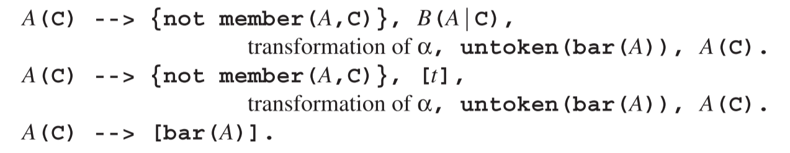
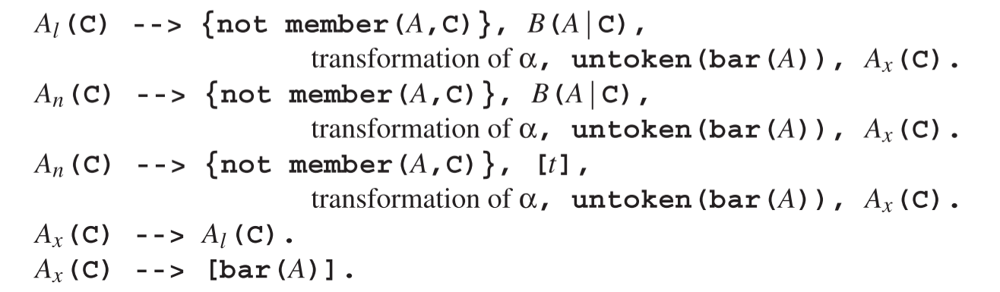
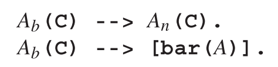
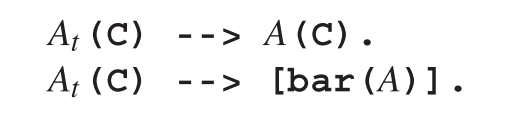
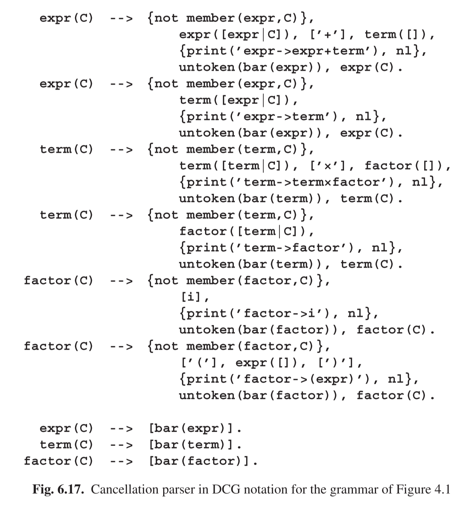
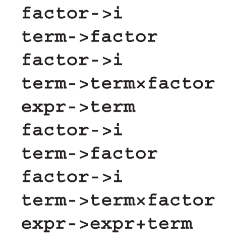

# 6.8.2 The Transformation Scheme

We assume that the Prolog DCG system has the possibility to intersperse the DCG rules with “normal” Prolog text by putting it between curly braces, and that the underlying Prolog system has a definition for a predicate member(E,L) which succeeds when E is a member of the list L. The transformation scheme for a non-terminal A to a set of DCG cancellation rules then consists of three patterns, one for rules of the form A → Bα, one for rules of the form A → tα, and one specific pattern to handle the A¯:

For the moment we assume that α is not empty; the complications with A → ε are treated in the next section.

This transformation scheme packs quite a few subtleties. The logic argument C is the cancellation set and the goal not member(A,C) implements the test whether A is already in the cancellation set. The transformation of the right-hand side follows the CF-DCG conversion shown in Section 6.7.2, except that all calls of non-terminals get a cancellation set as an argument. If the right-hand side starts with a non-terminal, that non-terminal gets a cancellation set equal to the old one extended with A;all other non-terminals get empty cancellation sets.

The DCG form untoken(bar(A)) pushes back a copy of A¯ into the input stream. It works as follows: the Prolog predicate untoken is defined as

untoken(T,S,[T|S]).

and the DCG processor will develop the DCG application untoken(a) into the Prolog goal untoken(a,Sentence,Remainder). As a result, a call of untoken(a,Sentence,Remainder) will set Remainder to [a|Sentence], thus prepending a to the rest of the input.

At this point in the pattern for A(C) we have recognized a Bα or a tα, reduced it and pushed it back as A¯; so in terms of input we have not made any progress and still have an A to parse, since that is what the caller of A(C) expects. This parsing process must be able to absorb the A¯ from the input and incorporate it in the parse tree. There are two candidates for this A¯: a left-recursive rule for A, and the caller of A(C).Inthefirstcaseanew A node will be constructed on the left spine; in the second the left spine of A nodes ends here. The Prolog system must consider both possibilities. This can be achieved by introducing a predicate Ax which is defined both as all left-recursive rules of A and as A¯. Also, to allow the new left-recursive rules to be activated, Ax must be called without the indication that A is already being investigated. So the transformation scheme we have now is

where Al stands for all left-recursive rules for A and An for all its non-left-recursive ones.

As long as there is an A¯ prepended to the input the only rules that can make progress are those that can absorb the A¯. One candidate is Ax(C)-->Al(C) and the other is the B in the first pattern. This B will usually be equal to A, but it need not be, if A is indirectly left-recursive; in that case a call of B will eventually lead to a call of an Al.Ifthe B is actually an A, its replacement in the transformation must be able to absorb an A¯, and must still be able to parse a non-left-recursive instance of A.So we need yet another predicate here, Ab, defined by

The fog that is beginning to surround us can be dispelled by a simple observation: we can add the non-left-recursive rules of A to Ax and the left-recursive ones to Ab, both without affecting the working of the parser, for the following reasons. The nonleft-recursive rules of A can never absorb the A¯, so adding them to Ax can at most cause failed calls; and calls to the left-recursive rules of A will be blocked by the left-recursion check preceding the Ab. So both Ax and Ab turn into a predicate At defined by

In addition to simplifying the transformation scheme, this also removes the need to determine which rules are left-recursive.

This simplification leaves only occurrences of A and At in the transformation, where the As can occur only in non-first position in right-hand sides. In those positions they can be replaced by Ats with impunity, since the only difference is that At would accept a A¯,but A¯s do not occur spontaneously in the input. So in the end there are only Ats left in the transformation patterns, which means that they can be renamed to A. This brings us to the transformation scheme at the beginning of the section.

Figure 6.17 shows the resulting cancellation parser for the grammar for simple arithmetic expressions of Figure 4.1. Notice that in

expr([expr|C]), [’+’], term([]), the first expr is the name of a DCG predicate and the second is just a constant, to be added to the cancellation set.

Rather than building up the parse tree in a logic variable we produce it here using print statements; since these are placed at the end of the recognition, the tree is produced in bottom-up order. Running this DCG cancellation parser with the query expr([],[i,’×’,i,’+’,i,’×’,i],[]) yields the following reversed rightmost derivation:

