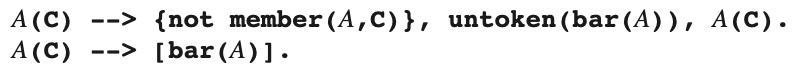
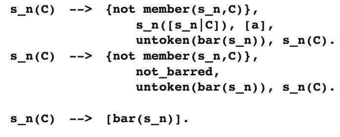

# 6.8.3 Cancellation Parsing with ε-Rules

Recognizing left-corner subtrees first has introduced a bottom-up component in our algorithm. We know that bottom-up techniques can have problems with ε-rules, and indeed, the naive transformation of a rule A → ε,

causes an infinite number of bar(A) tokens to be inserted in the input stream. As we wrote in Section 3.4.3.2, a bottom-up parser “will continue to find empty productions all over the place”.

The technical reason for this failure is that the simplification applied above does not hold for ε-rules. An ε-rule is a non-left-recursive rule and although it cannot absorb the A ̄, it can succeed, and so provides a way for the A ̄ to stay in the input. This immediately suggests a solution: block the recognition of empty productions when there is already a barred token as first token of the rest of the input. To check this condition, we need a predicate not_barred, the Prolog form of which can be defined as

not_barred(S,S):- not(S = [bar(X)|T]).

It succeeds unless S can be decomposed in some barred head X and some tail T; note that the eventual values of X and T are immaterial.

The technique is applied in the following DCG cancellation parser for the gram- mar S->Sa|ε:

